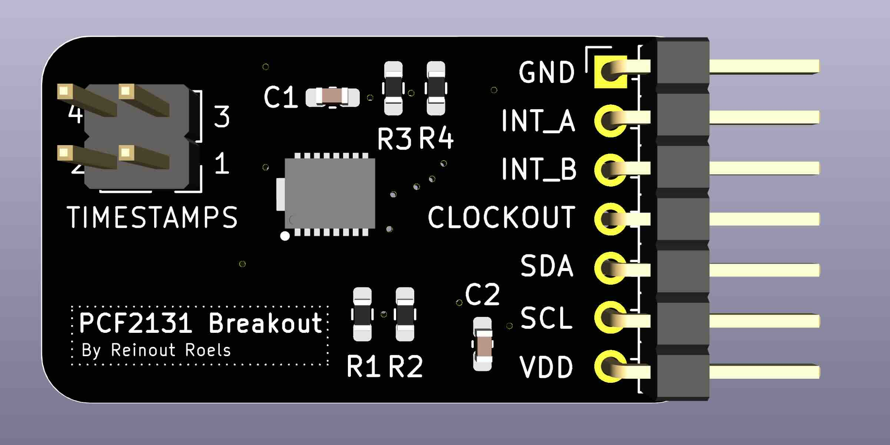
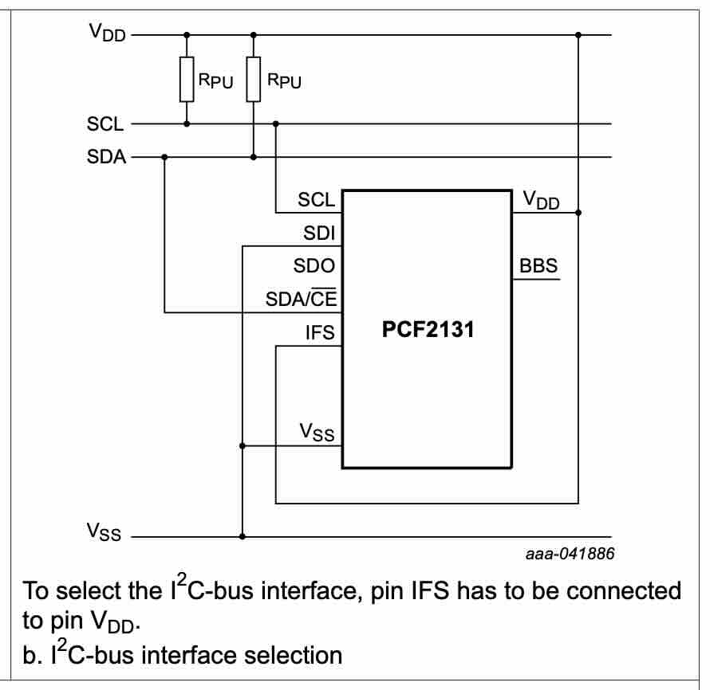
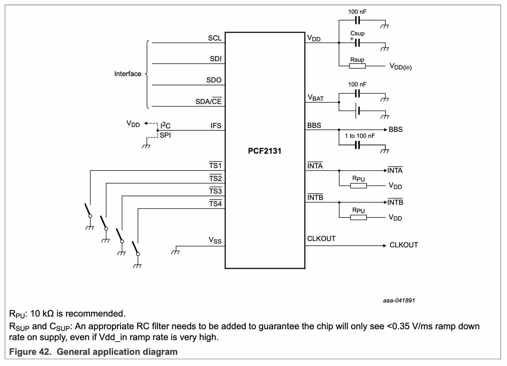
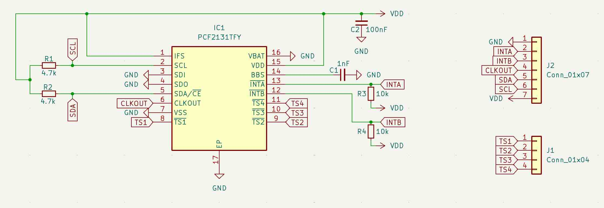
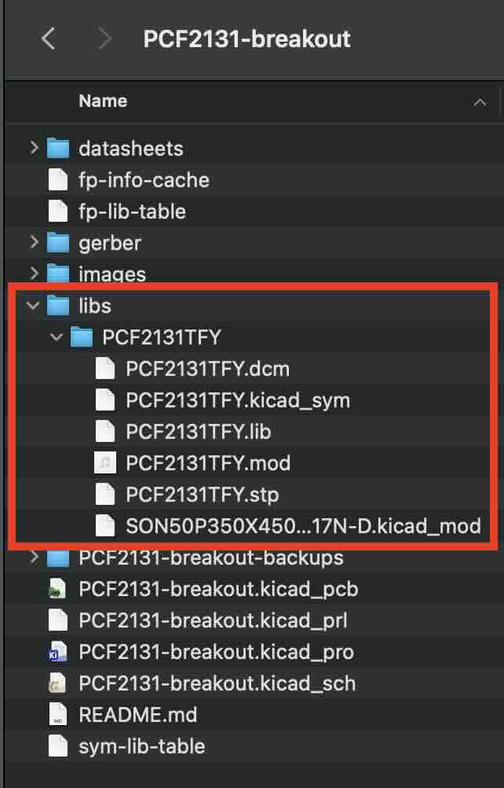

# NXP PCF2131 RTC Breakout Board

> [!WARNING]
> The information and material (code, designs, files, ...) are provided "AS IS". We make no representation or warranty of any kind, express or implied, regarding the accuracy, adequacy, validity, reliability, availability, or completeness of any information or material. Use this at your own risk.

## Introduction

This repository contains a small breakout board for the NXP PCF2131 RTC.

The board has already been manufactured and tested, and I can confirm it works.

However, some design choices have been made that might not meet your needs. 
For instance, the board is wired for I2C communication only, and there is no support for battery switch-over.
Please read section "Design Considerations" for more info on the design choices.

For use with an Arduino, the [RTC NXP Arduino](https://reference.arduino.cc/reference/en/libraries/rtc_nxp_arduino/) library can be used to interface with the chip.

## Design Considerations

* Although the PCF2131 supports both I2C and SPI, they require different circuitry, and the choice was made to only support I2C.
* As expected for a I2C, pull-up resistors are present on the I2C lines.
* The board was not made to support battery switch-over, and for this reason, it does not have the suggested RC filter circuitry.

## Schematics

We base ourselves on the following recommended circuits from the datasheet:

I deliberately left out the RC filter for battery switch-over functionality, which led to the following schematics:

## Bill of Materials (BOM)

| Reference | Footprint                                   | Qty | Value      |
|-----------|---------------------------------------------|-----|------------|
| C1        | C_0603_1608Metric_Pad1.08x0.95mm_HandSolder | 1   | 1nF        |
| R3,R4     | R_0603_1608Metric_Pad0.98x0.95mm_HandSolder | 2   | 10k        |
| J1        | PinHeader_2x02_P2.54mm_Vertical             | 1   | Conn_01x04 |
| R2,R1     | R_0603_1608Metric_Pad0.98x0.95mm_HandSolder | 2   | 4.7k       |
| C2        | C_0603_1608Metric_Pad1.08x0.95mm_HandSolder | 1   | 100nF      |
| IC1       | SON50P350X450X150-17N-D                     | 1   | PCF2131TFY |
| J2        | PinHeader_1x07_P2.54mm_Horizontal           | 1   | Conn_01x07 |

See image of the PCB below to have a better idea of what these components look like. 

All capacitors and resistors and SMD 0603. Instead of the horizontal pin header I used, a vertical pin header will also work fine (as long as the pitch is 2.54mm).

## How to Obtain the Physical PCB

The Gerber file is in this repository (`gerber/PCF2131-breakout.zip`). Simply upload this file a PCB manufacturer of your choice (JLPCB, PCBWay, ...), and you they will make it for you for as low as \$5 for 5 pieces (with the cheapest shipping option, which can take a few weeks).

> [!WARNING]
> Note that will still have to solder the components onto the PCB yourself!

## How to Edit Design

Everything you need to edit this design in KiCad 8 is included in the repository. 

However, this project uses symbols, footprints and 3D models from [Component Search Engine](https://componentsearchengine.com/). Their license allows us to do pretty much whatever we want with them, except redistributing them. For this reason I can't include them in this repository. 

If you would like to edit the design yourself, you will need to download the following component libraries from [https://componentsearchengine.com/](https://componentsearchengine.com/) (it's free!):

* [https://componentsearchengine.com/part-view/PCF2131TFY/NXP](https://componentsearchengine.com/part-view/PCF2131TFY/NXP)

From the downloaded zip file, move the content of the `KiCad` and `3D` subfolders into the project structure, so that the end-result looks like this:

The KiCad project is configured to look for these files in these locations, using relative paths, so no changes to the project itself are required. 

## Related Sources

* [https://www.nxp.com/products/analog-and-mixed-signal/real-time-clocks/nano-power-highly-accurate-rtc-with-integrated-quartz-crystal:PCF2131](https://www.nxp.com/products/analog-and-mixed-signal/real-time-clocks/nano-power-highly-accurate-rtc-with-integrated-quartz-crystal:PCF2131)
